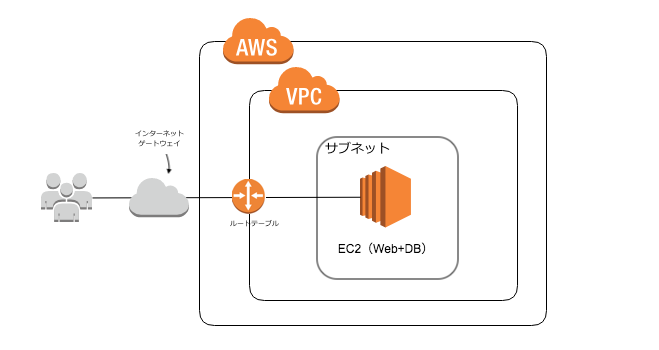

# 今回の構成図


# Terraformについて
## 使用バージョン
- Terraform v0.13.3

## Terraformインストール
```
$ brew update
$ brew install terraform
```
- aws cliが必要な場合があるので、併せてインストール

## IAMユーザーの作成、アクセスキー、シークレットキーの設定
- Terraformを使用する場合は、作成するリソースの権限を持ったIAMユーザーのアクセスキーを使用します。

## 秘匿情報について
`terraform.tfvars`に保存します。
```
access_key = "AWSIAMユーザーのアクセスキー"
secret_key = "AWSIAMユーザーのシークレットキー"
```
キーペア登録方法
https://kenzo0107.hatenablog.com/entry/2017/03/27/215941

## terraformの実行
### 初期化
```
terraform init
```
### 定義のチェック
エラーが発生する場合は、修正する。
```
$ terraform plan
```
### 定義の実行
実行する場合は以下のコマンド。更新時も同様
```
$ terraform apply
```
### 実行済み定義の確認
```
$ terraform show
```
### 作業中にリソースを削除したい場合
```
$ terraform destroy
```
